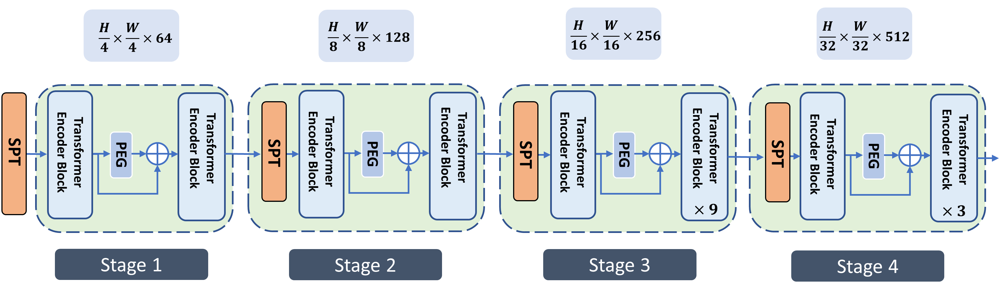

# C-PECT--Integration-of-conditional-positional-encoding-with-cross-scale-attention


In this approach, we propose C-PECT where we have explored how a transformer model performs when cross scale embeddings are integrated together. We first divide the input image into multiple patches. Every patch is reshaped by implementing a linear layer and then projected to form patches with embeddings. The dimensions of the embedded patches are reduced proportionately to the patch sizes of every stage. This reducing strategy enables us to generate multi scale feature maps at the same time keeping computational cost at linear. In our transformer layer we group the patches into multiple stages. In local grouping stage we group the neighboring patches together into blocks. In global grouping stage  the patches are assigned to same group after certain distance of the patches and blocks are formed. After this grouping mechanism self-attention are applied to the blocks. Our evaluation result using the MS COCO val2017 dataset yields an Accuracy Point (AP) of 40.0\% for 12 epochs and for 36 (3xCOCO) epochs  we achieved an AP of 43.7\% . After experimenting, our proposed network attains excellent results compared to state-of-the-art convolutional networks and on par with vision transformer variants including many concurrent works in computer vision tasks.


Figure 1. CPECT Architecture 

Then, install PyTorch 1.7.0+ and torchvision 0.8.1+ and pytorch-image-models 0.3.2:

First, clone the repository locally:
```
git clone https://github.com/nasim-ahmed/C-PECT---Integration-of-conditional-positional-encoding-with-cross-scale-attention.git
```
Then, install PyTorch 1.7.0+ and torchvision 0.8.1+ and [pytorch-image-models==0.3.2](https://github.com/rwightman/pytorch-image-models):

```
conda install -c pytorch pytorch torchvision
pip install timm==0.3.2
```

## Data preparation

Download and extract COCO dataset train2017, val2017 and test2017 images from https://cocodataset.org. Create a data folder inside detection and paste the coco folder there.


```
/detection/data/coco
  train2017/
      img1.jpeg
  val2017/
      img3.jpeg
  test2017/
      img4.jpeg
   
```

### Detection
Our code is based on  [mmdetection](https://github.com/open-mmlab/mmdetection). Please install [mmdetection](https://github.com/open-mmlab/mmdetection/blob/master/docs/get_started.md) first (we use v2.8.0).
We have used Mask R-CNN to evaluate our method. It's easy to apply CPECT in other detectors provided by mmdetection based on our examples.

#### Training
To train CPECT on COCO  with 2 gpus for 1x schedule (SWIN setting) under the framework of Mask R-CNN, run

```bash
 bash dist_train.sh configs/mask_rcnn_spt_cpect_1x_coco.py 2
```

#### Evaluation

To evaluate the mAP of CPECT on COCO  using 2 gpus based on  the Retina framework, run
```bash
bash dist_test.sh configs/mask_rcnn_spt_cpect_1x_coco.py checkpoint_file 2   --eval mAP
```
## Acknowledgement
We heavily borrow the code from [TWINS](https://github.com/Meituan-AutoML/Twins) and [CROSSFormer](https://github.com/cheerss/CrossFormer). Many thanks to them.
